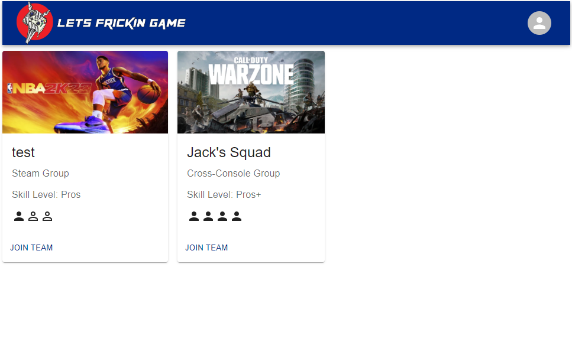

# Let's Frickin Game
​
## Table of Contents
​
- [Overview](#overview)
  - [The challenge](#the-challenge)
  - [User Story](#user-story)
  - [Acceptance Criteria](#acceptance-criteria)
  - [Screenshot](#screenshots)
  - [Links](#links)
  - [License](#license)
- [Installation](#installation)
  - [Package Installation](#package-installation)
  - [Environmental Variables](#environmental-variables)
  - [Seed Test Users](#seed-test-users)
  - [Starting the App](#starting-the-app)
- [Our process](#our-process)
  - [Built with](#built-with)
  - [What We learned](#what-we-learned)
  - [Continued development](#continued-development)
  - [Useful resources](#useful-resources)
- [Author](#author)
- [Acknowledgments](#acknowledgments)
​
## Overview
​
### The challenge
​Our challenge was to create a React application using the MERN stack. We had to utilize GraphQl for 

​
### User Story
​
```
AS A Person who plays video games
I WANT a place to post that I am looking for a team
SO THAT I may join up with other players

```
​
### Acceptance Criteria
​
```
GIVEN a site that shows available teams
WHEN I go to the Home Page
THEN I am presented with current postings of available teams
WHEN I click on a post
THEN I am presented with the team and their details
WHEN I click to join
THEN I am added to team roster
WHEN I go to my current team
THEN I am presented my current squad
WHEN I click on Profile
THEN I am presented with my profile and all of my associated usernames for my different consoles
WHEN I click Create Team
THEN I am presented with a form to fill out with my settings for my new team
WHEN I click sign up
THEN I am presented with the signup page
WHEN I click the toggle on the signup page
THEN I am presented instead with the login page
```

### Screenshots

#### Landing Page​



### Links
​
- Live Site URL: [Let's Frickin Game](https://lets-frickin-game.herokuapp.com/)

### License
This project is licensed under an MIT license

## Installation

### Package Installation

```javascript
npm i
```

### Environmental Variables

```
MONGODB_URI
SESSION_SECRET
```
​
### Seed Test Users

```
npm run seeds
```

### Starting the app

```
npm run develop
```

## Our process
​
### Built with
​
 - MongoDB
 - ExpressJS
 - React
 - NodeJS
 - GraphQL
 - MaterialUI


​
### What We learned
​
Long story short we all learned a great deal about implementing the MERN stack in an application. We quickly learned how to allocate our efforts to highlight natural talents. Lastly we learned a good deal about git with different issues arising during pull requests and merges.

​
### Continued development
Some ideas we have for future features we want to add are: 

- ​Team leader
- Join multiple teams
- Light & dark mode
- Leaving teams
- Design
- Rate your teamates
- Game stats for each player
- Add unlisted games

​
### Useful resources
​
- [MaterialUI](https://mui.com/material-ui/getting-started/overview/) - React Component Library
- [MDN Web Docs](https://developer.mozilla.org/en-US/docs/Learn/JavaScript) - In-depth documentation for elements or functions
- [stackoverflow](https://stackoverflow.com/) - Answered specific questions from various collaborators

## Authors
​
- [James Montogmery](https://github.com/jmonty94)
- [Jack Youkstetter](https://github.com/JackYouk)
- [Daniel Holloway](https://github.com/VendettiStudios)
- [Michael Harris](https://github.com/Snufalufakis)
- [Mousa Dia](https://github.com/TheAnswer07)

## Acknowledgments
​